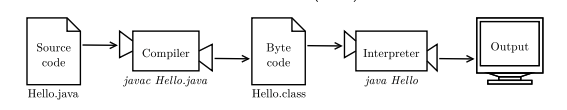
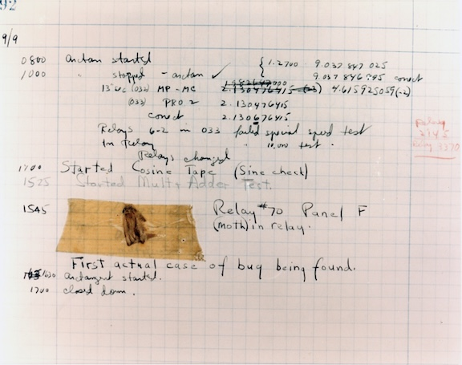

# Introduction


The goal of this class is to get you to think like a programmer. 

## What is Programming?


Programming is a set of instructions that specifies how to perform a computation on computer hardware. The computer must be told in escrutiating detail how to do anything - machines understand neither hints, nor humor, and can't imagine what you mean unless you tell it exactly right.

Beleieve it or not, computers can't do much. Here's a list of all the instructions that are acceptable:

- **Input**
  - Get data from a keayboard, file, sensor or other device.
- **Output**
  - Display data on a screen or send it to a file or other device.
- **Math**
  - Perform basic mathematical operations.
- **Secision**
  - Check for certain conditions and execute the appropriate code.
- **Repetition**
  - Perform an action repeatedly, usually with some variation.

Every program you've ever used, regardless of how complex or sophisticated it appears, is made up of these small blocks of intructions. It follows that **programming** actually is the process of breaking a large, complex task into smaller and smaller subtasks, until they are small and simple enough to be performed with the electronic circuits provided by the hardware.

## Problem solving

As a programmer most of the time we are solving problems. We get a problem and we need to be the ones that figures out the solution for that problem. Instead of just trying blindly to apply random solutions, hoping somehting works, we will give you a framework for solving problmes.


### Understand

The first part of solving a problem is understanding the problem. Here are two quotes that stress the importance of understanding your problem

> “If you can’t explain something in simple terms, you don’t understand it.” — Richard Feynman


> “If I had an hour to solve a problem I'd spend 55 minutes thinking about the problem and 5 minutes thinking about solutions.” - Albert Einstein

So we need to understand the problem before trying to solve it. It makes intuitive sense but what we see is that novice students often spend to little time understanding. To help you understand a problem try some of these methods

- Write the problem down
- Doodle a diagram
- Tell someone else about your problem
- Or use [rubber duck debugging](https://en.wikipedia.org/wiki/Rubber_duck_debugging) (this technique has helped me many many times)


### Plan

When we truly understand the problem as well as we can, we need to plan for fixing the problem. 

Planning gives your brain time to analyze the problem and properly process the information. It is a task that is not done often enough especially among novice programmers. Beginners have a tendency to just start solving a problem. This typically affects the solution that in turn has not been structured well/thought through/have problems.

So how should a plan be made then? It's up to you. Typically just writing down in steps how you are going to solve the problem is sufficient. Another helpful tool when planning writing some software is [writing pseudo code](https://www.geeksforgeeks.org/how-to-write-a-pseudo-code/) 


### Divide

By this stage the you should have a clear understanding of the problem and an overall plan for how you will fix the problem. 

Now we need to divide the problem into smaller subproblems.

Dividing a problem into smaller subproblems can help solve a problem becuase smaller subproblems are easier to fix than larger problems. When you have solved all the subproblems, connect the dots. 

> “If I could teach every beginning programmer one problem-solving skill, it would be the ‘reduce the problem technique.’

An example could be to figure out how many ping pong balls can fit in a car. Let's first figure out how many ping pong balls can be in a qubic meter using a divide tactic 👇

- Hmm that's tough but how many can be in a qubic decimetre. Probably around 9 or 10
- So in a cubic meter there would be 10.000 ping pong balls
- How many cubic meter fits in a car? Maybe around 30, depends on the size.
- Okay so 30 * 10.000 is 300.000 ping pong balls in a car


## Exercises

- How many hairdressers ar in Copenhagen?
- How many ants are in an ant colony?
- How many piano tuners are in Germany?
- What angle does an hour hand describe in 20 minutes?
- Two circles have radius equal to 2 cm and 3 cm. The distance between their centres is 4 cm. Do they interact?
- A can of kerosene weighs 8 kg. Half the kerosene is poured out of it, after which the can weighs 4.5 kg. What is the weight of the empty can? 
- What time is it now if the time which passed since noon constitutes a third of the time that remains until midnight?


Harvard questions:


# Hello World!

A long tradition in Computer Science mandates that the first program you learn in a new programming language must be [Hello World!](https://en.wikipedia.org/wiki/%22Hello,_World!%22_program). All it does it output the words `Hello World!`to the screen. In Java, it looks like this:

```Java
public class Hello {
    public static void main(String[] args) {
        // here is my comment
        System.out.printIn("Hello World!);
    }
}
```

When the program runs, you should show you the text `Hello World!`.


### Compiling Java Programs

The programming language we are learning is [Java](https://en.wikipedia.org/wiki/Java_(programming_language)), a **high-level-language**. Before they run, high-level languages must be translated into a **low-level-language**, also called a machine language. 

An **interpreter** reads a high-level program, line-by-line and executes it incrementally.

A **compiler** reads the entire program and translates it completely before the program starts running. Once the program is compiled, you can execute it repeatedly without further translation. For this reason, compiled programs often run faster than interpreted programs. 

Unfortunately, the low-level code is not portable. Meaning that you cannot run an executable compiled for a Windows machine on an Android phone. To run a program on different kinds of machines, you must compile it for every device.

To solve this, Java is *both* compiled and interpreted. Instead of translating source code directly into an executionable, the Java compiler generates code for a **virtual machine**. This "imaginary" machine has the functionality of common to desktops, laptops, tablets and smartphones. This is called **Java Byte Code**. 

### The Compilation Process



1. The programmer (you!) writes the code.
2. Save in the file `Hello.java`.
3. Use **javac** to compile it.
4. If there are no errors, the copiler saves the byte code in the file *Hello.class*.
5. To run the program, you use java to interpret the byte code and the result is then displayed on the screen.



### Debugging

[Grace Hopper](https://en.wikipedia.org/wiki/Grace_Hopper), who invented the compiler, also coined the term **debugging*, at a time when a computer took up the space of an entire building, and running a program could be interrupted by a moth getting stuck in a relay! 

Today a bug is what we call all and any *programming errors*, and debugging is the process of of tracking down the errors and *fixing* them. Debugging is an art-form and one of the most valuable skills you can develop as a programmer. It can be incredibly frustrating to find the error and spent lots of time on it, especially if it turns out to be something like a typo. Just know that the best programmers aren't the 'smartest', but the people who are the most stubborn and willing to try over and over until they find a solution to the problem at hand.

Also, don't hesitate to reach out to a teacher or classmate if you feel stuck for too long on an excercise.


### Excercises

### 1. 
For the excercises we will be writing the classical "HELLO World!"program in Java.

**Note: To compile java programs you have to have JDK installed: https://www.oracle.com/java/technologies/downloads/**


To compile a program: 

```
javac HelloWorld.java
```

To run a program:

```
java HelloWorld
```

Output should be:

```
Hello World!
```

If the program looks like this:

```java
public class HelloWorld{
	public static void main(String[] args){
		System.out.println("Hello World!");
	}
}
```

### 2. 

Display **Multiple lines** of text in your program. Add another line printing more text after "Hello World!". 

```java
public class HelloWorld{
	public static void main(String[] args){
		System.out.println("Hello World!");
        // add more text here!
	}
}
```
### 3. 

**Without adding a new line**

`System.out.println` appends a special character, called *newline* that moves to the beginning of the next line. Try changing your program, so that the second line will be displayed on the same line as the first one, by replacing with `System.out.print`, removing just the `ln`.


### 4. 

Add a comment to the program anywhere. Recompile and run it again. The new comment shouldn't affect the result.
