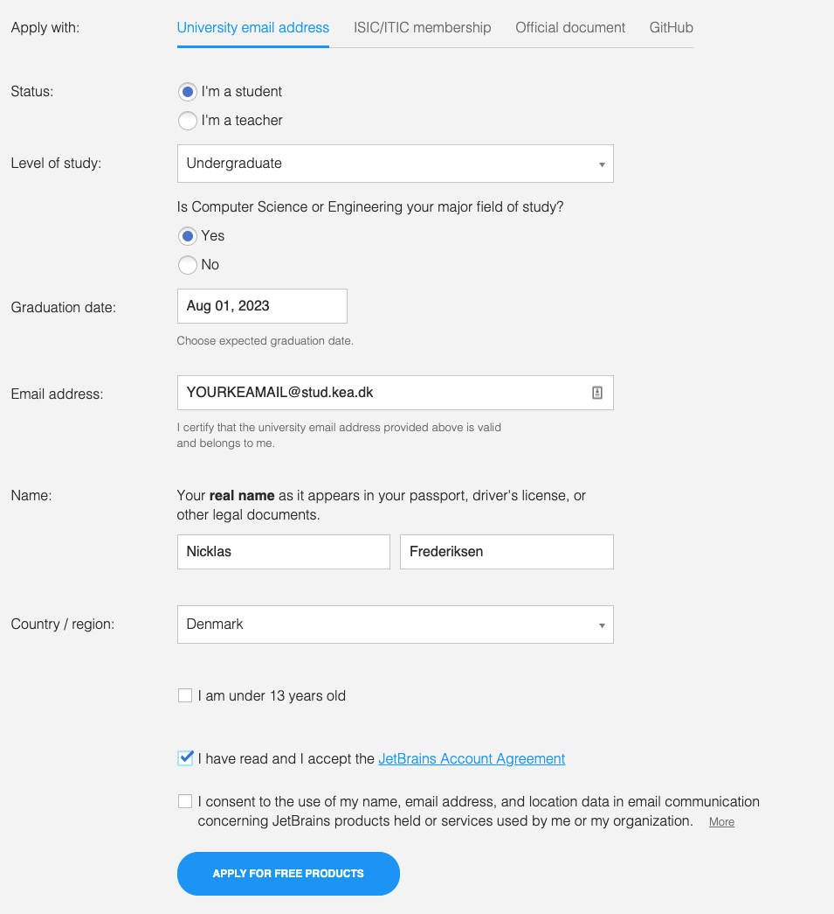

# Hello World

## The Command Line

Before we get into coding, we must have a grasp of the most important tools needed for programming. 

[Command Line Crash Course](https://learnpythonthehardway.org/book/appendixa.html)

Complete exercises 1-15 from this list, or as many as you can.


## Hello Intellij

Today we are progressing to a new editor called IntelliJ.

Intellij is a professionel development tool for writing programs. It is one of the most popular tools for java and we will be using this Integrated Development Environment (IDE) throughout the semester. 

It is recommended to use **IntelliJ Ultimate Edition** which is a premium solution (meaning you have to pay for a license)

You **do** have a license for IntelliJ Ultimate Edition - activate it by registering with your KEA e-mail. 

Use your KEA e-mail to register here: https://www.jetbrains.com/community/education/#students



**AFTER** registering a Jetbrains user with your @stud.kea.dk e-mail - download intelliJ ultimate edition from here: https://www.jetbrains.com/idea/download/


**Note: To compila java programs you have to have JDK installed: https://www.oracle.com/java/technologies/javase-downloads.html**


## The compilation process


# Hello World!

A long tradition in Computer Science mandates that the first program you learn in a new programming language must be [Hello World!](https://en.wikipedia.org/wiki/%22Hello,_World!%22_program). All it does it output the words `Hello World!`to the screen. In Java, it looks like this:

```Java
public class Hello {
    public static void main(String[] args) {
        // here is my comment
        System.out.printIn("Hello World!);
    }
}
```

When the program runs, you should show you the text `Hello World!`.


### Compiling Java Programs

The programming language we are learning is [Java](https://en.wikipedia.org/wiki/Java_(programming_language)), a **high-level-language**. Before they run, high-level languages must be translated into a **low-level-language**, also called a machine language. 

An **interpreter** reads a high-level program, line-by-line and executes it incrementally.

A **compiler** reads the entire program and translates it completely before the program starts running. Once the program is compiled, you can execute it repeatedly without further translation. For this reason, compiled programs often run faster than interpreted programs. 

Unfortunately, the low-level code is not portable. Meaning that you cannot run an executable compiled for a Windows machine on an Android phone. To run a program on different kinds of machines, you must compile it for every device.

To solve this, Java is *both* compiled and interpreted. Instead of translating source code directly into an executionable, the Java compiler generates code for a **virtual machine**. This "imaginary" machine has the functionality of common to desktops, laptops, tablets and smartphones. This is called **Java Byte Code**. 

### The Compilation Process


1. The programmer (you!) writes the code.
2. Save in the file `Hello.java`.
3. Use **javac** to compile it.
4. If there are no errors, the copiler saves the byte code in the file *Hello.class*.
5. To run the program, you use java to interpret the byte code and the result is then displayed on the screen.


### Debugging

[Grace Hopper](https://en.wikipedia.org/wiki/Grace_Hopper), who invented the compiler, also coined the term **debugging*, at a time when a computer took up the space of an entire building, and running a program could be interrupted by a moth getting stuck in a relay! 

Today a bug is what we call all and any *programming errors*, and debugging is the process of of tracking down the errors and *fixing* them. Debugging is an art-form and one of the most valuable skills you can develop as a programmer. It can be incredibly frustrating to find the error and spent lots of time on it, especially if it turns out to be something like a typo. Just know that the best programmers aren't the 'smartest', but the people who are the most stubborn and willing to try over and over until they find a solution to the problem at hand.

Also, don't hesitate to reach out to a teacher or classmate if you feel stuck for too long on an excercise.


### Excercises

### 1. 
For the excercises we will be writing the classical "HELLO World!"program in Java.

**Note: To compile java programs you have to have JDK installed: https://www.oracle.com/java/technologies/downloads/**


To compile a program: 

```
javac HelloWorld.java
```

To run a program:

```
java HelloWorld
```

Output should be:

```
Hello World!
```

If the program looks like this:

```java
public class HelloWorld{
	public static void main(String[] args){
		System.out.println("Hello World!");
	}
}
```

### 2. 

Display **Multiple lines** of text in your program. Add another line printing more text after "Hello World!". 

```java
public class HelloWorld{
	public static void main(String[] args){
		System.out.println("Hello World!");
        // add more text here!
	}
}
```
### 3. 

**Without adding a new line**

`System.out.println` appends a special character, called *newline* that moves to the beginning of the next line. Try changing your program, so that the second line will be displayed on the same line as the first one, by replacing with `System.out.print`, removing just the `ln`.


### 4. 

Add a comment to the program anywhere. Recompile and run it again. The new comment shouldn't affect the result.
